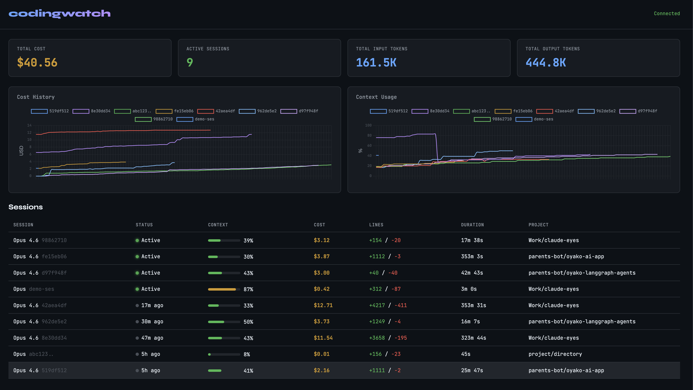

# codingwatch

Real-time observability for AI coding agents.

[](https://github.com/sandeepdatalume/codingwatch/actions/workflows/ci.yml)
[](LICENSE)
[](https://www.python.org/downloads/)



---

## Features

- **Live metrics collection** — captures session data from AI coding agents (Claude Code supported, OpenCode and others planned)
- **Prometheus export** — `/metrics` endpoint with per-session gauges
- **OTLP/HTTP export** — pull via `/api/v1/export/otlp` or push to any OTLP backend
- **Single-file dashboard** — real-time session overview, no build step required
- **SQLite primary storage** — WAL mode for concurrent writes, zero config
- **PostgreSQL dual-write** — optional production-grade persistence
- **Docker Compose stack** — collector + Postgres + Prometheus + Grafana in one command
- **Extensible** — designed to support any AI coding agent, not just Claude Code

## Architecture

```
statusline.sh (stdin JSON → stdout status text → background POST)
    ↓
FastAPI collector (port 9876)
    ↓
SQLite (primary) + PostgreSQL (optional dual-write)
    ↓
GET /metrics (Prometheus) | GET /api/v1/export/otlp | GET /api/v1/stats (dashboard)
```

## Quick Start

```bash
curl -fsSL https://raw.githubusercontent.com/sandeepdatalume/codingwatch/main/install.sh | bash
```

That's it. This clones the repo, installs dependencies, configures Claude Code's statusline, and starts the collector. Restart any running Claude Code sessions to start collecting metrics.

The dashboard opens automatically at `http://localhost:9876`.

### Docker Compose

```bash
docker compose up -d                              # Core: collector + Postgres
docker compose --profile observability up -d      # + Prometheus + Grafana
```

| Service     | URL                          |
|-------------|------------------------------|
| Collector   | http://localhost:9876         |
| Dashboard   | http://localhost:9876         |
| Prometheus  | http://localhost:9090         |
| Grafana     | http://localhost:3000         |

## Configuration

All configuration is via environment variables:

| Variable | Default | Purpose |
|----------|---------|---------|
| `COLLECTOR_PORT` | `9876` | Collector HTTP port |
| `SQLITE_PATH` | `~/.claude/metrics.db` | SQLite database location |
| `DATABASE_URL` | _(none)_ | PostgreSQL connection string for dual-write |
| `OTLP_ENDPOINT` | _(none)_ | OTLP push target URL |
| `LOG_LEVEL` | `INFO` | Logging level (DEBUG, INFO, WARNING, ERROR) |

## Metrics Reference

### Prometheus (`GET /metrics`)

Per-session gauges with labels `session_id`, `model`, `project`:

| Metric | Unit | Description |
|--------|------|-------------|
| `claude_session_cost_usd` | USD | Total session cost |
| `claude_session_duration_seconds` | s | Session duration |
| `claude_session_api_duration_seconds` | s | API call duration |
| `claude_session_lines_added` | lines | Lines of code added |
| `claude_session_lines_removed` | lines | Lines of code removed |
| `claude_session_input_tokens` | tokens | Total input tokens |
| `claude_session_output_tokens` | tokens | Total output tokens |
| `claude_session_context_used_percent` | % | Context window utilization |

Aggregate metrics:
- `claude_active_sessions` — number of active sessions
- `claude_total_cost_usd` — sum of all session costs

### OTLP (`GET /api/v1/export/otlp`)

Same metrics as Prometheus with full `session_id` attribute, in OTLP/HTTP JSON format.

## Development

```bash
# Install in editable mode with dev dependencies
pip install -e ".[dev]"

# Run tests
python -m pytest collector/ -v

# Lint
ruff check collector/
ruff format --check collector/
```

## Project Structure

```
codingwatch/
├── collector/
│   ├── app.py              # FastAPI endpoints
│   ├── config.py           # Environment variable config
│   ├── db.py               # SQLite/PostgreSQL storage
│   ├── models.py           # Pydantic models
│   ├── prometheus.py       # Prometheus text renderer
│   ├── otlp.py             # OTLP/HTTP builder & push
│   ├── Dockerfile
│   └── test_*.py           # 33+ tests
├── dashboard/
│   └── index.html          # Single-file live dashboard
├── statusline/
│   └── statusline.sh       # Claude Code statusline hook
├── grafana/                # Grafana provisioning
├── docker-compose.yml
├── prometheus.yml
├── schema.json             # Claude Code payload schema (read-only)
├── setup.sh                # One-command local setup
└── pyproject.toml
```

## Team / Org Deployment

For centralized metrics across a team, deploy the collector on a shared server and point each developer's statusline at it.

**1. Deploy the central collector:**

```bash
# On a VM, cloud instance, or k8s cluster
git clone https://github.com/sandeepdatalume/codingwatch.git
cd codingwatch
docker compose --profile observability up -d
```

**2. Each developer — one-time setup:**

```bash
# Install codingwatch locally (configures Claude Code automatically)
curl -fsSL https://raw.githubusercontent.com/sandeepdatalume/codingwatch/main/install.sh | bash

# Point at the central collector (add to your shell profile)
echo 'export CLAUDE_METRICS_URL=https://metrics.yourcompany.com/metrics' >> ~/.zshrc
```

All sessions from the team will flow into the central collector, with per-session breakdowns visible in the dashboard, Prometheus, and Grafana.

## Roadmap

- [ ] **OpenCode integration** — plugin for [OpenCode](https://opencode.ai) that posts session metrics (cost, tokens, model) to the collector via `session.idle` / `session.updated` events
- [ ] **Gemini CLI integration** — support for Google's Gemini CLI agent
- [ ] **Aider integration** — support for [Aider](https://aider.chat) sessions
- [ ] **Multi-agent dashboard** — unified view across different AI coding tools
- [ ] **Cost alerts** — configurable thresholds with notifications

## License

[MIT](LICENSE)
